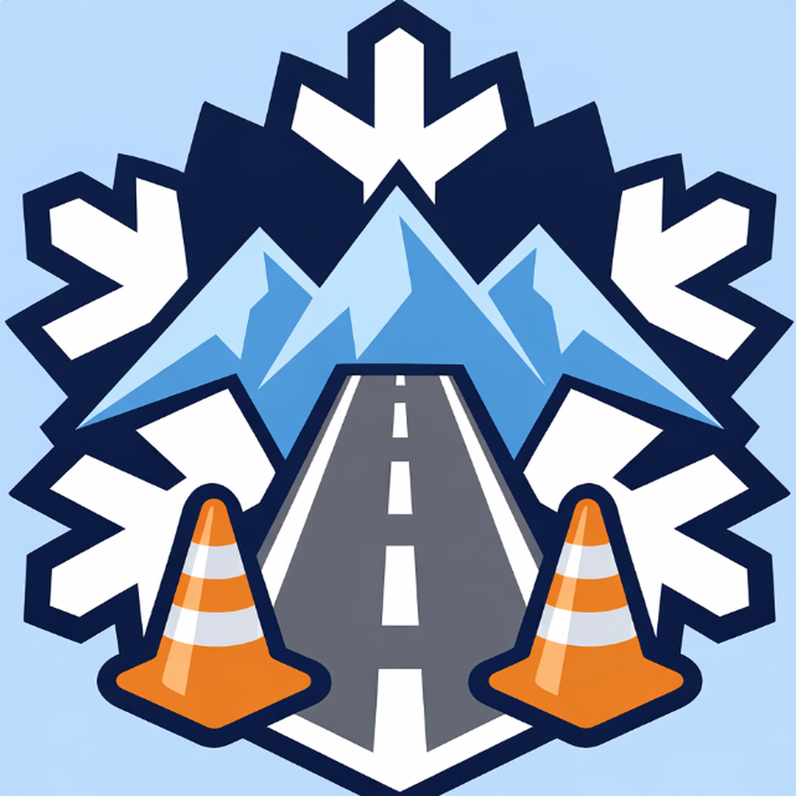
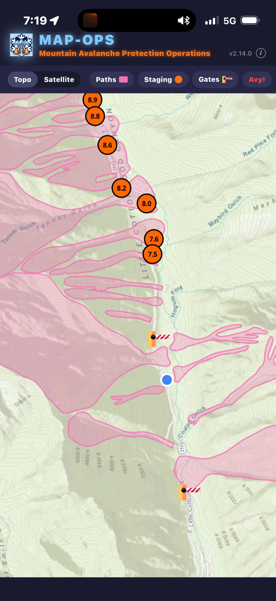
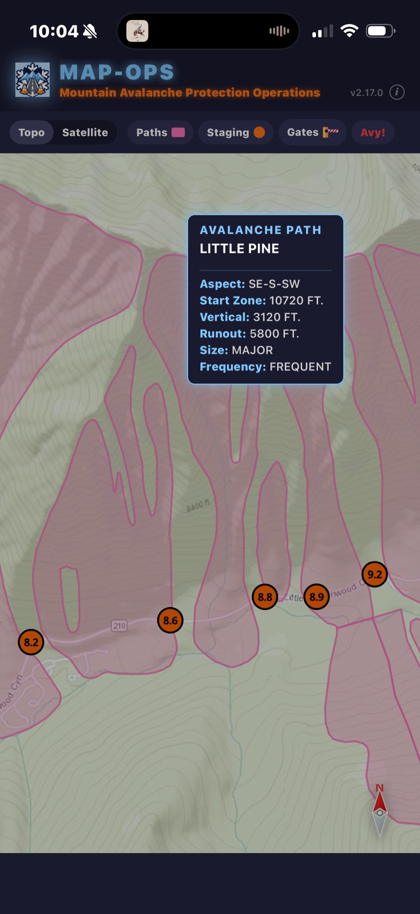
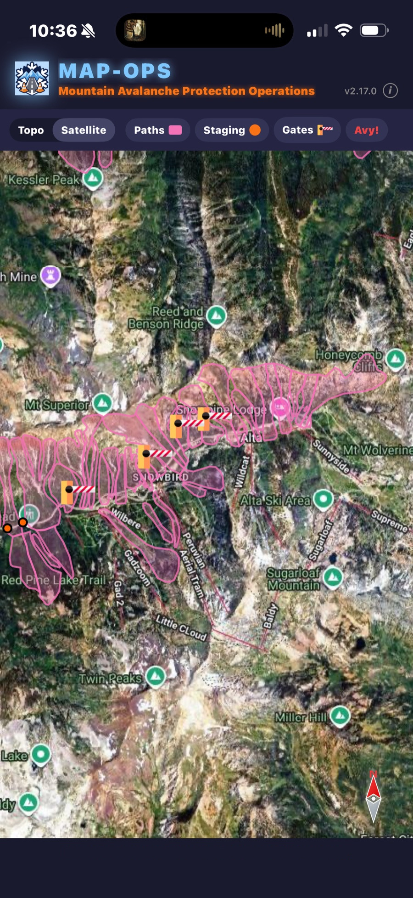

  

<h1 align="center">MAP-OPS</h1>

<strong>Mountain Avalanche Protection and Operations</strong>

  An offline map app for avalanche control teams supporting roadway public safety in Utah's Cottonwood Canyons.

---

When a storm rolls into the Wasatch, the canyons close. Avalanche control teams move along the road — coordinating gate closures, staging personnel at mile markers, and referencing historical avalanche path data to decide where to fire artillery and where to wait it out. Often times teams are operating in the dark, in dangerous conditions, in places where cell service is unreliable or absent.

MAP-OPS puts the operational map on the phone they already carry, and makes it work whether or not the network does. It coordinates the Utah Department of Transportation, local police departments, and ski area personnel who all work together during high avalanche conditions and heavy roadway traffic.

## Screenshots

| Live location tracking | Avalanche path detail | Toggle features & satellite |
| :---: | :---: | :---: |
|  |  |  |

## What it does

- **Custom offline basemaps** — Shaded topographic relief and satellite imagery for the Salt Lake and Provo canyons, bundled with the app. Toggle between them without a network.
- **Operational layers** — Avalanche paths, UDOT closure gates, and staging areas labeled by mile marker. Overlaid on the basemap, toggleable, with tap-to-view detail popups (aspect, vertical, runout, size, frequency).
- **Live GPS location** — Your dot on the map, in real time, against the same basemap and layers everyone on the team is looking at.
- **Field-friendly controls** — Pan bounds clamped to the basemap extent so you can't wander off the data. Large, glove-friendly toggles. Debug panel hidden by default.

## Stack

- **React Native + Expo** for the cross-platform app shell
- **MapLibre GL JS** for rendering, served inside a WebView
- **MBTiles** (via `expo-sqlite`) for offline tile delivery
- Custom **`rntile://`** protocol that bridges WebView tile requests to native SQLite reads

## Status

**Available on iOS App Store · Android**. Currently in TestFlight beta. Used in the field by UDOT, local police, and Cottonwood Canyon ski area avalanche teams.

## Case study

A more detailed write-up — the why, the rough edges, what shipped — lives at [**barryswinston.com/work/map-ops**](https://barryswinston.com/work/map-ops/).

---

Built by <a href="https://barryswinston.com">Barry Winston</a> · © 2026

